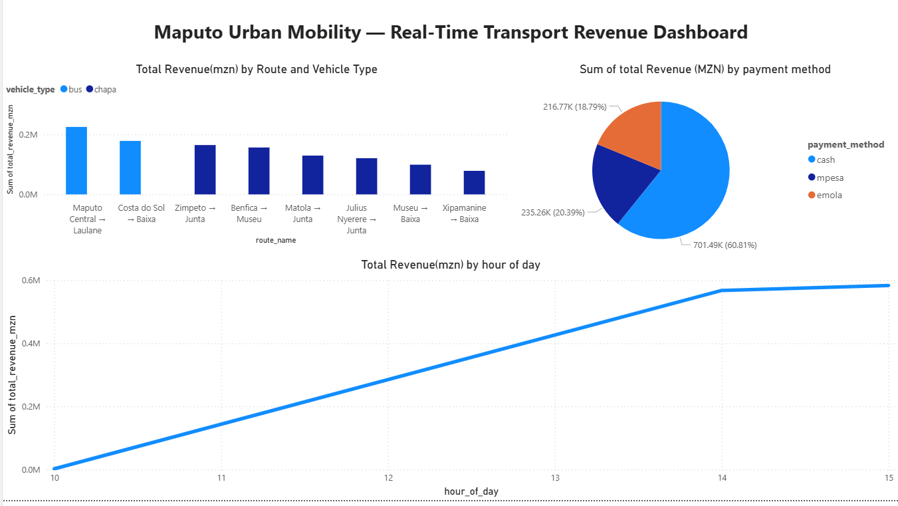
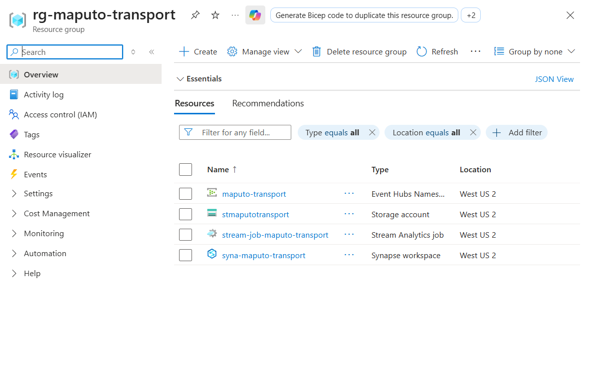

# 🚌 Maputo Urban Mobility — Real-Time Transport Pipeline

> End-to-end streaming data pipeline tracking chapa & bus ride revenue across Maputo, Mozambique — built on Microsoft Azure.


---

## Overview

This project simulates a real-time data pipeline for Maputo's public transport network — tracking ride events across 8 major chapa and bus routes, streaming revenue analytics in Meticais, and visualising insights on a live Power BI dashboard.

Built to demonstrate data engineering patterns: partitioned stream processing, late-arriving data handling, serverless query architecture, and cost-optimised cloud storage.

---

## Architecture


```
Python Producer
      │
      ▼
Azure Event Hubs   [4 partitions, keyed by route_id]
      │
      ▼
Azure Stream Analytics     [4 parallel queries stored in the storage accounts]
  ├── Raw passthrough      → raw/
  ├── 5-min revenue window → revenue/
  ├── Hourly leaderboard   → leaderboard/
  └── Overload alerts      → alerts/
      │
      ▼
Azure Data Lake Gen2      ← Parquet, LRS tier
      │
      ▼
Synapse Serverless SQL    ← OPENROWSET + views, zero idle cost
      │
      ▼
Power BI Dashboard        ← Live Maputo Urban Mobility report
```

---

## Dataset

Fully synthetic data generated by `fake_data_generator.py`, modelled on real Maputo transport patterns:

| Field | Description |
|-------|-------------|
| `route_name` | 8 real Maputo routes (e.g. Matola → Junta, Museu → Baixa) |
| `vehicle_type` | Chapa (capacity 15) or Bus (capacity 40) |
| `fare_per_person_mzn` | Fare in Mozambican Meticais, with peak-hour surge |
| `total_revenue_mzn` | Total revenue per trip |
| `payment_method` | Cash, M-Pesa (Vodacom), M-Pesa (Mcel) |
| `occupancy_pct` | % of capacity filled |
| `is_peak_hour` | Rush hours: 6–8am, 12pm, 5–7pm |
| `vehicle_condition` | Good / Fair / Poor |

---

## Key Engineering Decisions

**Partitioning by `route_id`**
Events are keyed by route at the Event Hubs level, ensuring all trips on the same route land on the same partition. Stream Analytics aggregations run without cross-partition shuffling.

**Tumbling + Hopping windows**
- 5-minute tumbling window → exact per-interval revenue for billing accuracy
- 60-minute hopping window (15-min refresh) → rolling leaderboard, always current

**Serverless SQL over dedicated pool**
Synapse Serverless charges ~$5/TB queried vs $1.20/hr for a dedicated pool running idle. For bursty analytical workloads this is an 80%+ cost saving.

**Late-arriving data**
`TIMESTAMP BY` uses the event's embedded timestamp rather than arrival time — correctly handles network delays common in bandwidth-constrained environments.

**SAS token authentication**
Database-scoped credential with a SAS token grants Power BI direct, auditable access to the Data Lake without broad IAM role assignments.

---

## Project Structure

```
├── fake_data_generator.py       # Synthetic Maputo ride event generator
├── eventhub_producer.py         # Async Event Hubs producer (azure-eventhub SDK)
├── stream_analytics_queries.sql # 4 Stream Analytics queries
├── synapse_queries.sql          # 5 analytical queries + view definitions
├── requirements.txt
└── .env.template                # Credentials template (never commit .env)
```

---

## Setup

### Prerequisites
- Azure subscription
- Python 3.10+
- Power BI Desktop

### 1. Azure resources
Create these in one Resource Group:


| Service | Config |
|---------|--------|
| Event Hubs Namespace | Basic tier, 4 partitions |
| Storage Account | Hierarchical namespace enabled (ADLS Gen2) |
| Synapse Workspace | Linked to storage account above |

### 2. Local setup
```bash
pip install -r requirements.txt
cp .env.template .env
# Add your Event Hubs connection string to .env
```

### 3. Run the producer
```bash
python fake_data_generator.py 
python eventhub_producer.py
```

### 4. Stream Analytics
- Input: Event Hubs (`MaputoInput`), partition key `route_id`
- Outputs: 4 ADLS Gen2 outputs mapped to `raw/`, `revenue/`, `leaderboard/`, `alerts/`
- Query: paste `stream_analytics_queries.sql`
- Start job → Now

### 5. Synapse
- Create database `MaputoTransportDB`
- Run `synapse_queries.sql` to create external data source + 4 views
- Connect Power BI Desktop via Synapse serverless SQL endpoint

---

## Dashboard

**Maputo Urban Mobility — Real-Time Transport Revenue Dashboard**

- Revenue by route — which routes generate the most Meticais
- MPesa vs Cash split — mobile money adoption across the network
- Revenue by hour of day — peak hour surge patterns

---

## Tech Stack

`Python` `Azure Event Hubs` `Azure Stream Analytics` `Azure Data Lake Gen2` `Azure Synapse Analytics` `Power BI` `SQL` `Parquet`
